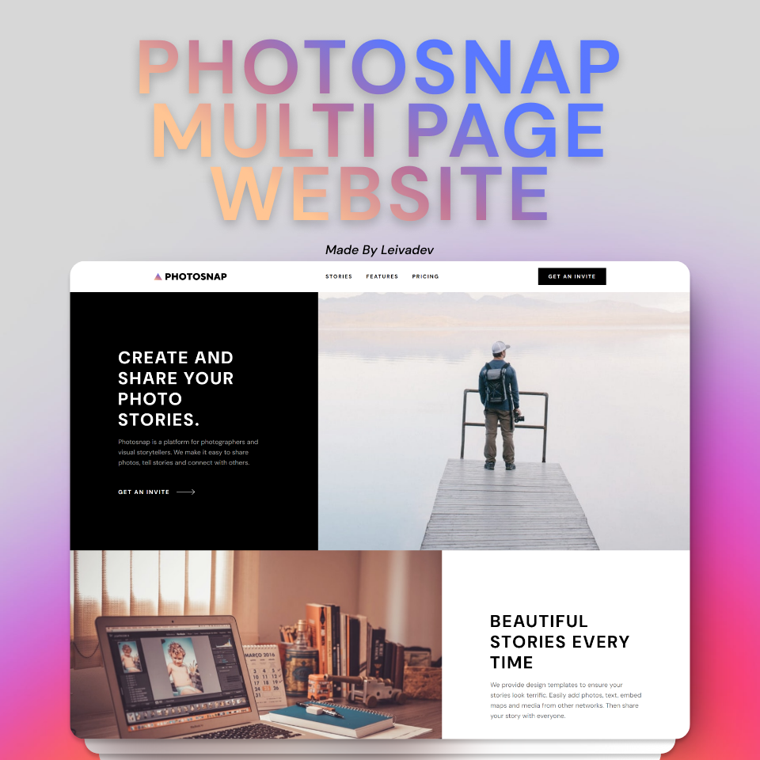
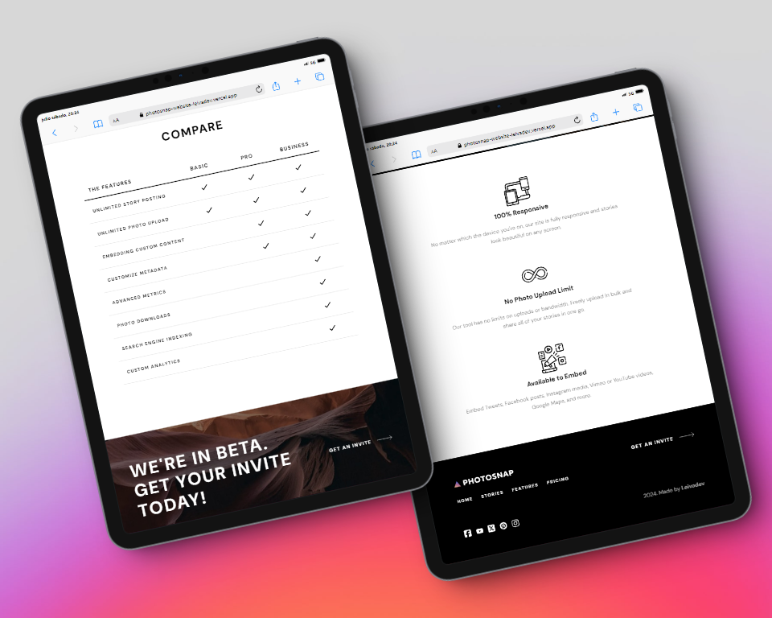
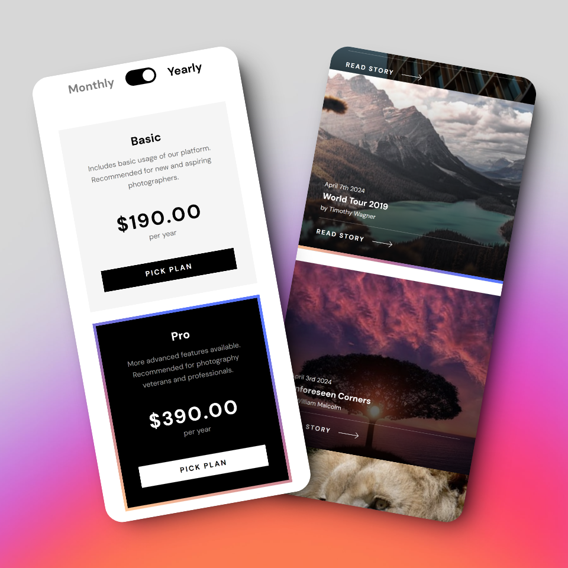

# Photosnap Multipage Website


**[Click to see Live Site URL!](https://photosnap-website-leivadev.vercel.app/)**

Hey there!👋 This is my solution to the [Photosnap multipage website challenge on Frontend Mentor](https://www.frontendmentor.io/challenges/photosnap-multipage-website-nMDSrNmNW) using Astro web framework.

## Built with 🔧

- [Astro](https://astro.build/) - The web framework for content-driven websites.
- Typescript.
- Semantic HTML5 & CSS3.
- Flexbox & Grid.
- Mobile-first Workflow.

## Run Locally 🏠

Clone the project

```bash
  git clone https://github.com/leivadev/photosnap-multi-page-website.git
```

Go to the project directory

```bash
  cd my-project
```

Install dependencies

```bash
  npm install
```

Start the server

```bash
  npm run start
```

## Roadmap 📌

- Improve Accessibility using ARIA.
- Add neat transitions.
- Light/dark mode toggle.
- Clean Code.

## Acknowledgments 💯

- Inspirations:
  - [Frontend Mentor](https://www.frontendmentor.io/challenges/photosnap-multipage-website-nMDSrNmNW)
- Icons & SVG: [Font Awesome](https://fontawesome.com/)
- Mockups: [shots.so](https://shots.so/)

## Screenshots 📸





## Author 🧑‍💻

### Leivadev - Software Developer from Panama

<a href="https://www.github.com/leivadev" target="_blank" rel="noreferrer"></a>
<a href="https://www.linkedin.com/in/leivadev" target="_blank" rel="noreferrer"> </a>
<a href="https://www.x.com/leivadev" target="_blank" rel="noreferrer"> </a>
